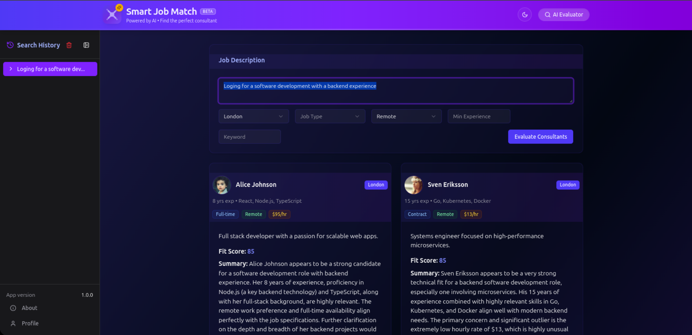

# 🔍 Smart Job Match Web App

A modern **React + TypeScript + TailwindCSS** application that helps clients evaluate consultants based on job descriptions using AI-powered insights.

---



## 🚀 Features

- ✅ **AI-Powered Consultant Evaluation:**  
  Uses Google's Gemini API to evaluate consultant profiles against job descriptions and provide detailed insights.

- ✅ **Customized Fit Analysis:**  
  Generates personalized fit scores, summaries, pros, cons, and suggested interview questions for each consultant.

- ✅ **Advanced Filtering System:**  
  Filter consultants by location, job type, workplace preference, experience level, and keywords.

- ✅ **Persistent Search History:**  
  Saves job description searches in local storage for easy reference and reuse.

- ✅ **Collapsible Sidebar:**  
  Responsive design with a collapsible search history sidebar that adapts to all screen sizes.

- ✅ **Modern UI Components:**  
  Built with shadcn/ui and Tailwind CSS for a clean, accessible interface.

- ✅ **Nested Routes & Code-Splitting**
 Uses React Router v7.6.0 nested routes, with each route lazy-loaded for modularity and performance.
  Performance optimization technique in modern JavaScript applications (like React apps) that involves breaking up the code into smaller chunks so that only the code needed for the current page or feature is loaded at first.
---

## 🗂️ Application Structure

- **Components**
  - `ConsultantCard`: Displays consultant profile and AI evaluation results.
  - `SearchHistory`: Manages previous searches with delete functionality.
  - `MainPanel`: Contains job description input and filtering controls.

- **Services**
  - `gemini.ts`: Handles communication with Google's Gemini AI API.

- **Data**
  - `data.json`: Mock consultant profiles with skills, experience, and rates.

- **State Management**
  - Uses React hooks and localStorage for persistent state.
  
- **Contexts**
  - `GeminiContext`: Provides AI service access throughout the application.

---

## ✨ How It Works

1. **User enters a job description** in the main input area.
2. **User applies filters** (optional) to narrow down consultant matches.
3. **AI evaluates each consultant** against the job description when user clicks "Evaluate".
4. **Results display** as cards with detailed fit analysis for each consultant.
5. **Search history saves automatically** and can be accessed from the sidebar.

---

## ✅ Example: AI Evaluation

```json
{
  "fitScore": 85,
  "summary": "Excellent match with strong React and TypeScript experience",
  "pros": [
    "8 years of relevant experience",
    "Expert in required technologies",
    "Remote work capability"
  ],
  "cons": [
    "Higher hourly rate than some candidates",
    "No experience with specific industry"
  ],
  "questions": [
    "Can you describe your experience with large-scale React applications?",
    "How do you approach learning new technologies quickly?"
  ]
}
```

The application sends structured prompts to the AI and processes JSON responses to create these detailed evaluations.

---

## 🛠️ Dependencies & Technologies

- [React](https://react.dev/) + [TypeScript](https://www.typescriptlang.org/)
- [Vite](https://vitejs.dev/) for fast development and building
- [React-route](https://reactrouter.com/start/declarative/installation) a multi-strategy router for React
- [Tailwind CSS](https://tailwindcss.com/) for styling
- [shadcn/ui](https://ui.shadcn.com/) for accessible UI components
- [Google Gemini API](https://ai.google.dev/docs/gemini_api) for AI evaluations
- [Lucide Icons](https://lucide.dev/) for beautiful SVG icons
- [Storage](https://developer.mozilla.org/en-US/docs/Web/API/Window/localStorage) Local storage for search history persistence

---

## 🧠 What You Get
| Feature           | Implementation                                 |
| ----------------- | ---------------------------------------------- |
| ✅ Lazy Loading    | `React.lazy()` and `Suspense`                  |
| ✅ Code Splitting  | `import()` dynamically splits JS files         |
| ✅ Nested Routing  | `React Router` with `<Outlet />`               |
| ✅ Fast Load Time  | Small initial JS bundle, loads pages on demand |
| ✅ Context Support | Auth and global state via `Context.Provider`   |


## 🚀 Getting Started

1. Clone the repository

```bash
git clone https://github.com/BenMukebo/Smart-job-match-web-app
cd smart-job-match-web-app
```

2. Install dependencies

```bash
npm install
```

3. Set up environment variables

```bash
# Create a .env file with your Gemini API key
echo "VITE_GEMINI_API_KEY=your_api_key_here" > .env
```

4. Start the development server

```bash
npm run dev
```

5. Open your browser and navigate to `http://localhost:5173`

---


## 📝 Usage

- **Enter a job description** in the main text area
- **Apply filters** using the dropdown selectors and input fields
- **Click "Evaluate Consultants"** to generate AI insights
- **View past searches** in the sidebar and click to recall them
- **Delete individual searches** or clear all history as needed

---

## ⚙️ Developer Tips

- Use `npm run build` to create a production build
- The app is fully responsive - test on different viewport sizes
- Each consultant evaluation runs as a separate API call to Gemini
- Customize the prompt in `App.tsx` handleEvaluate() function to refine AI responses

---

## 📂 Project Structure

```
src/
├── api/
│   └── data.json        # Mock consultant data
├── components/
│   └── custom/          # Custom components
│       ├── ConsultantCard.tsx
│       ├── SearchHistory.tsx
│       └── MainPanel.tsx
├── config/
│   └── gemini.ts        # Gemini API configuration
├── contexts/            # React contexts
├── layout/              # Layout components
│   ├── header.tsx
│   └── footer.tsx
├── lib/
│   └── types.ts         # TypeScript type definitions
└── App.tsx              # Main application entry point
```

---

## 🧠 Summary
Smart Job Match Web App demonstrates how AI can transform the consultant hiring process by providing personalized, 
data-backed evaluations. It features a modern UI built with React and shadcn/ui, with intelligent state management 
for search history and filtering preferences.

---

## 🤝 Contributing

Contributions are welcome! Feel free to submit a pull request or create an issue to discuss enhancements or bug fixes.

---

## 📄 License

MIT License. See [LICENSE](LICENSE) for details.